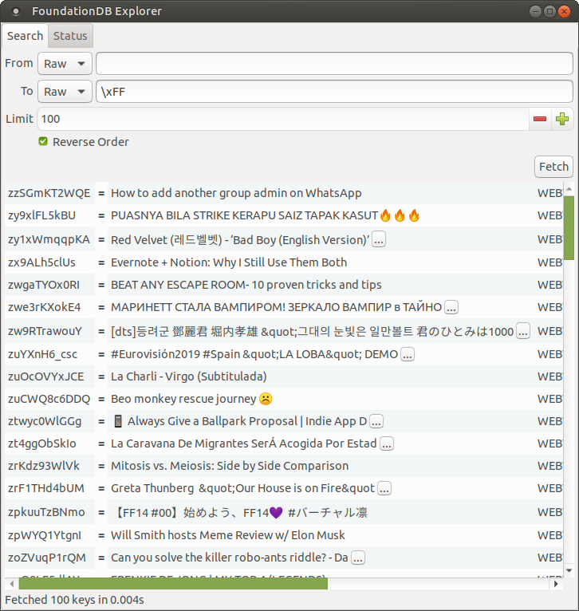

# FoundationDB Explorer

This is a very basic visual data viewer for FoundationDB databases. You can search by key in raw binary form or by entering a tuple value that is then encoded into binary form. Keys and values in search results are presented in their tuple form when they can be decoded as such.

Built using (currently a slightly hacked version of) the awesome https://github.com/owickstrom/gi-gtk-declarative/.

## Status

Not particularly finished, probably won't work for you, etc.

## Installation

Those with Ubuntu-based systems can try the `.deb` package from the [Github releases page](https://github.com/Dretch/foundationdb-explorer/releases).

## Building

Install the Stack build system, clone the Git repo and then do: `stack test && stack install`