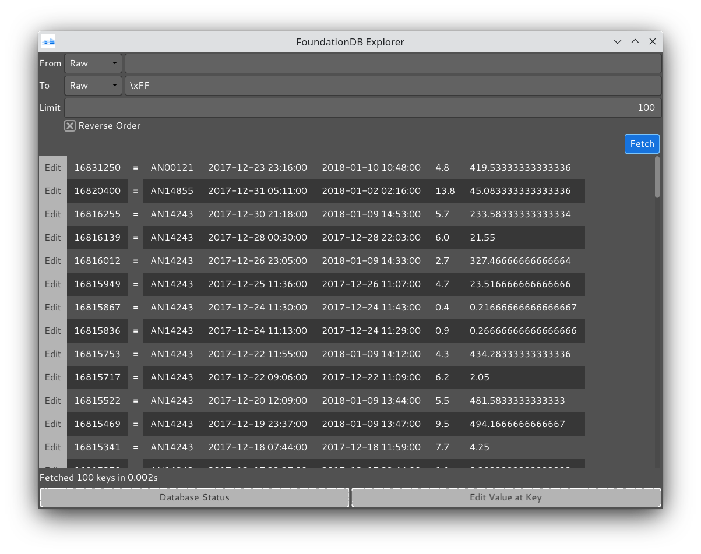
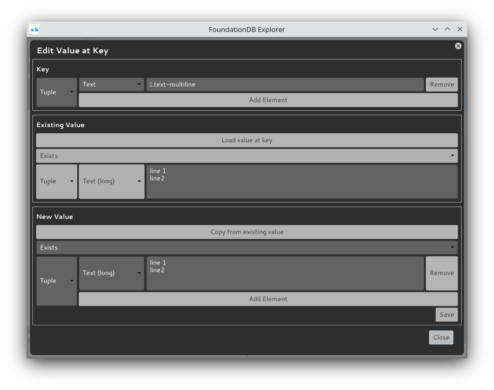

# FoundationDB Explorer

This is a very basic visual data viewer / editor / GUI for [FoundationDB](https://www.foundationdb.org/) databases.

Built using (currently a slightly hacked version of) the awesome [gi-gtk-declarative](https://github.com/owickstrom/gi-gtk-declarative/) library.

## Features

### Search

Search by key in raw binary form or by entering a tuple value that is then encoded into binary form. Keys and values in search results are presented in their tuple form when they can be decoded as such. 

### Edit

You can set, update, or delete the value at a known key. The key and value can be entered either in raw binary form or as a tuple.

## Status

Experimental - some rough edges and not well tested.

## Installation

Those with Ubuntu-based systems can try the `.deb` package from the [Github releases page](https://github.com/Dretch/foundationdb-explorer/releases). A _FoundationDB Explorer_ application should then appear in your desktop environment.

## Building

Install the [Stack](https://docs.haskellstack.org/en/stable/README/) build system, clone the Git repo and then do: `stack test && stack install`